# WitnessGap

**Know when an agent trace cannot justify a cause.**

WitnessGap is a typed Python benchmark and certificate verifier for
identifiability in tool-agent failure attribution. It asks a question that
ordinary replay-based debugging often skips:

> Did the evidence identify the cause, or did one repair merely happen to be
> sufficient?

A successful patch shows that an intervention can change the outcome. It does
not show that the patched component was the unique original cause. WitnessGap
constructs *causal twins*: sealed worlds with byte-identical public failures but
different minimal repairs. When both worlds remain compatible with the
available trace, the honest verdict is `not_identifiable`, accompanied by a
machine-verifiable ambiguity certificate.

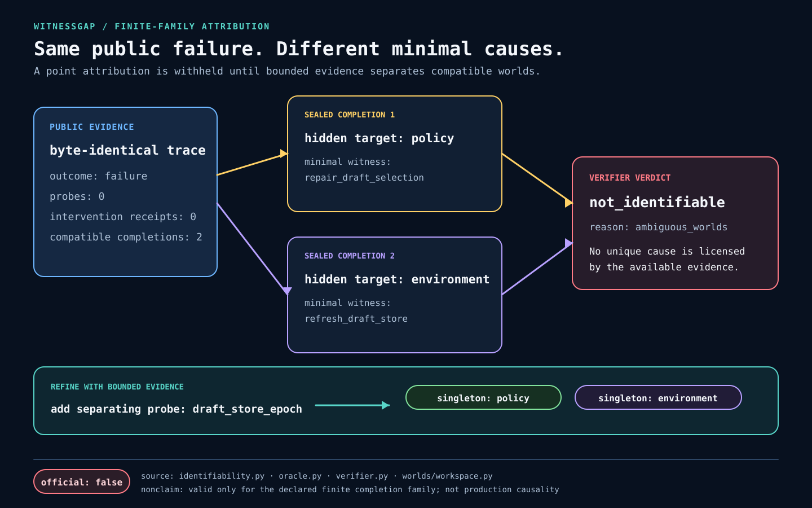

The claim is intentionally bounded. A verdict is valid relative to an explicit
state schema, intervention algebra, success oracle, and committed finite
completion family. WitnessGap does **not** claim that this family exhausts
production failure mechanisms.

## Why sufficiency is not identifiability

Suppose refreshing a stale store makes an agent task succeed. That observation
establishes the refresh as a sufficient repair under the replayed state. The
same failed trace may still be compatible with:

- an environment completion where the store really was stale; and
- a policy completion where the selector was wrong, but the refresh happened
  to alter the concrete resolution.

Point attribution is justified only after the evidence rules out the
incompatible completion. In the smallest included example, one informative
probe does that; the unprobed trace does not.

WitnessGap represents the distinction with five verdict forms:

| Verdict | Meaning |
| --- | --- |
| `identified_singleton` | One target is shared by every compatible minimal repair. |
| `identified_compound` | One irreducible repair requires multiple targets. |
| `alternative_minimal_repairs` | Several incomparable minimal repairs remain. |
| `effect_only` | An intervention changes the outcome without localizing the original fault. |
| `not_identifiable` | Compatible hidden worlds imply incompatible causal verdicts. |

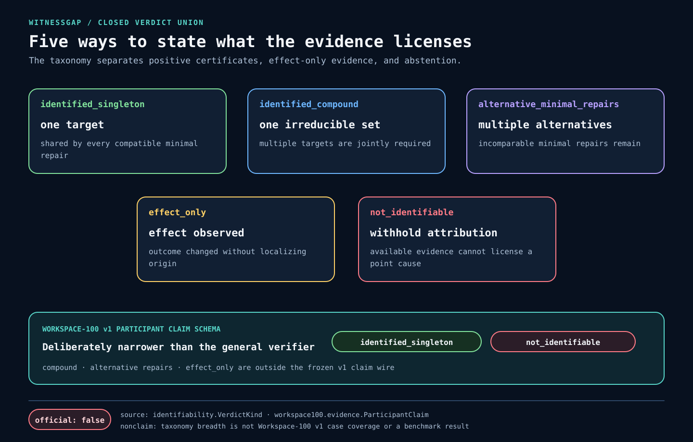

Workspace-100 v1 deliberately admits only `identified_singleton` and
`not_identifiable` on its participant wire. The other verdicts belong to the
wider WitnessGap attribution contract.

## Current status

The core verifier, deterministic Workspace-100 construction, evaluator, scorer,
release builder, materializer, rooted loader, and semantic release checker are
implemented. One runtime-bound development candidate has been captured and
checked. It is not an official or public benchmark release.

| Boundary | Implemented | Not established |
| --- | --- | --- |
| Attribution | Finite-family registries, exhaustive repair panels, positive and negative certificates, exact canonical verification | Exhaustiveness over real production failures |
| Workspace-100 | 5 templates, 50 variants and twin pairs, 100 sealed completions, 4 evidence views, 300 participant cases | Learned-system or production-agent benchmark claims |
| Evaluation | 4 frozen controls, 1,200 fresh-process records, closed ClaimSet, exact rational scoring | A second clean capture under another valid transient schedule; gate 12 remains open |
| Release integrity | 13 payloads, closed 25-binding manifest, read-only-mode materialization, rooted load, full semantic replay | Independently authenticated public root, signatures, attestation, or provenance history |
| Python distribution | Closed sdist surface, archive preflight, repeated byte-identical builds, sdist-built pure-Python wheel, RECORD replay, no-index clean-venv CLI probes | Network isolation, PyPI publication, package signing, or runtime support beyond exact CPython 3.12.3 on Linux x86_64 |
| Worker lifecycle | Fresh directory and process session, closed environment, bounded pipes, timeout and process-group cleanup | Hostile-code containment; gate 16 remains open |

## Quick start

The development lock is intentionally specific to **CPython 3.12.3 on Linux
x86_64**. The exact patch version is recorded in
[`.python-version`](.python-version), and every active dependency in the
development environment is hash-pinned.

```bash
# Provide the exact interpreter recorded by the repository.
cat .python-version
# 3.12.3

python3.12 -m venv .venv
source .venv/bin/activate
python --version
# Python 3.12.3

python -m pip install --require-hashes -r requirements-dev.lock
python -m pip install --no-deps --no-build-isolation --editable .

# Build the declared sdist, rebuild its wheel, install with no index, and probe the CLI.
python tools/verify_distribution.py
```

Verify the smallest causal-twin certificate:

```bash
witnessgap example
```

The deterministic JSON includes:

```json
{
  "compatible_completion_count": 2,
  "official": false,
  "unknown_reason": "ambiguous_worlds",
  "verdict": "not_identifiable"
}
```

Inspect the frozen Workspace-100 construction:

```bash
witnessgap workspace100
```

Selected verified fields from that command are:

```json
{
  "counts": {
    "assignments": 400,
    "builtin_methods": 4,
    "completions": 100,
    "fresh_process_runs_in_full_matrix": 1200,
    "pairs": 50,
    "participant_cases": 300,
    "templates": 5,
    "variants": 50
  },
  "hostile_code_containment": "not_established",
  "official": false,
  "public_release_published": false
}
```

Its current cardinalities are 5 templates, 50 variants and pairs, 100
completions, 400 private assignments, 300 participant cases, and 4 frozen
built-in methods. The returned `fresh_process_runs_in_full_matrix: 1200` is a
construction cardinality. This command builds the deterministic corpus, public
views, and baseline registry in process; it does **not** launch 1,200 workers or
report a benchmark result.

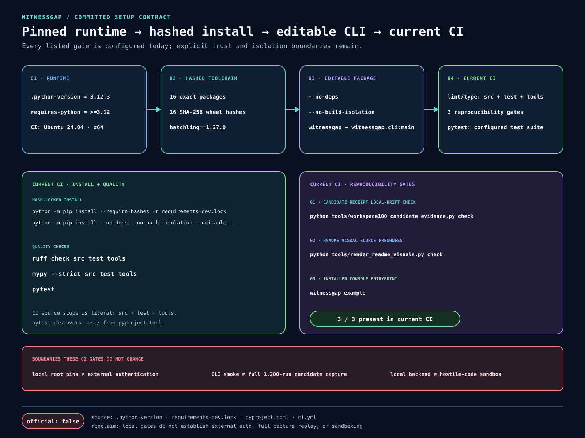

## Certificate API

The public example builds a finite registry, observes one failed trace, derives
an ambiguity certificate, and then verifies the serialized certificate through
the separate verifier path:

```python
from witnessgap.identifiability import CandidateRegistry, VerdictKind
from witnessgap.verifier import (
    trust_anchor_for_manifest,
    verify_attribution_certificate,
    verify_registry_attribution,
)
from witnessgap.worlds.workspace import workspace_sources, workspace_twins

worlds = workspace_twins()
registry = CandidateRegistry.build(worlds)
evidence = registry.observe(worlds[0].world_id)

# Local authoring helper for this self-contained example.
anchor = trust_anchor_for_manifest(registry.manifest)

certificate = verify_registry_attribution(
    workspace_sources(),
    manifest=registry.manifest,
    trust_anchor=anchor,
    evidence=evidence,
)
verified = verify_attribution_certificate(
    certificate.to_canonical_bytes(),
    trust_anchor=anchor,
    expected_proof_root=certificate.proof_root,
)

assert verified.kind is VerdictKind.NOT_IDENTIFIABLE
assert verified.unknown_reason is not None
assert verified.unknown_reason.value == "ambiguous_worlds"
assert len(verified.compatible_completion_commitments) == 2
```

`trust_anchor_for_manifest` is a local authoring convenience, not external
authentication. A real consumer must obtain the trust anchor and expected
proof root through an independent trusted channel. Re-deriving both from the
artifact under review would only prove internal consistency.

## Workspace-100

Workspace-100 is a frozen synthetic engineering slice that tests two bounded
claims:

1. the same public failure can remain compatible with different minimal
   causes; and
2. one relevant probe or replay receipt can refine that ambiguity into a
   justified singleton attribution.

Five authored tool scenarios each contain ten variants and two sealed
completions. Deterministic generation produces 50 twin pairs and 100 episodes.
The projection layer creates 400 private episode-to-view assignments, then
deduplicates byte-identical public evidence into 300 participant cases.

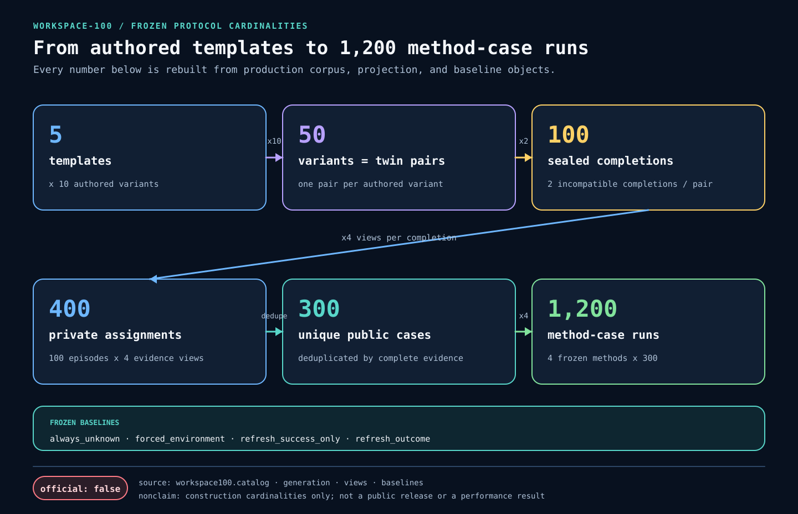

### Evidence changes what can be claimed

Every public case exposes the failed baseline trace and outcome. The four views
then differ only in the additional evidence they license:

| View | Cases | Additional evidence | Expected construction verdict |
| --- | ---: | --- | --- |
| `trace_only` | 50 | None | `not_identifiable` |
| `owner_probe` | 50 | One deliberately irrelevant owner observation | `not_identifiable` |
| `epoch_probe` | 100 | One completion-separating epoch observation | `identified_singleton` |
| `refresh_receipt` | 100 | One bounded environment-refresh replay | `identified_singleton` |

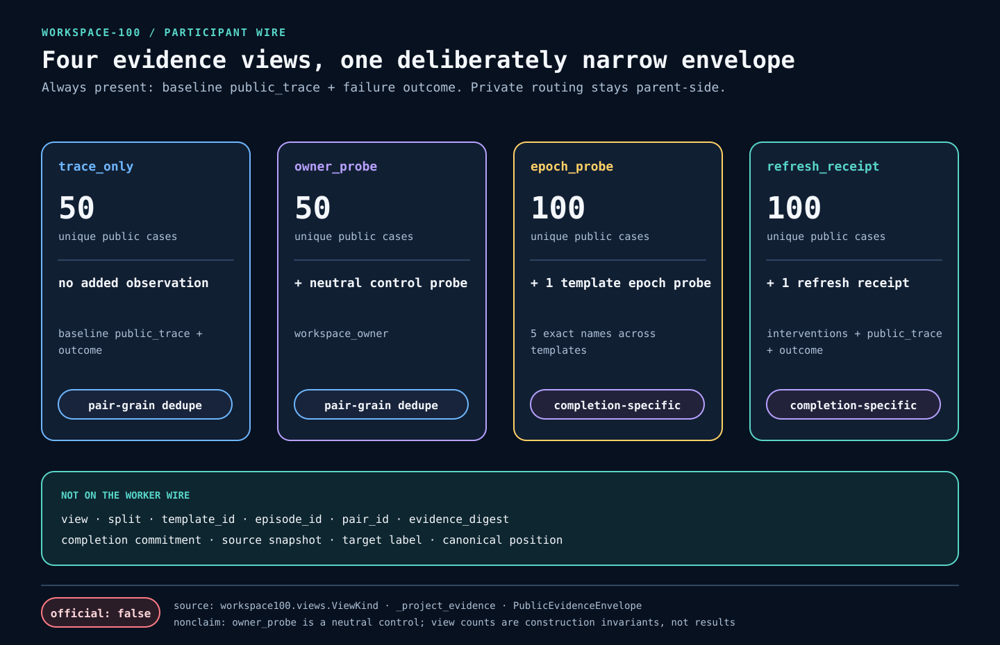

The participant record omits world IDs, completion commitments, pair IDs,
labels, other views, unqueried receipts, and evaluation truth. Private routes
remain on the evaluator side. Recursive leak checks inspect decoded byte
fields as well as JSON structure.

The evaluator independently replays sealed sources to author 300
case-bound certificates: 100 ambiguity certificates and 200 singleton
certificates, balanced 100/100 across environment and policy targets. These
counts are protocol construction invariants, not empirical model performance.

## Measured development candidate

The repository records **one successful clean capture only** in the
[canonical candidate receipt](docs/evidence/workspace100-candidate-receipt.json).
It is useful reproducibility evidence for the implemented pipeline, but it is
neither a public release nor an independently authenticated attestation.

| Measured fact | Exact value |
| --- | --- |
| Runtime | CPython 3.12.3, Linux x86_64 |
| Resolved interpreter binary SHA-256 | `1643dacd9feaedc58f3cc581e4d22577dfe25c09b10282936186ccf0f2e61118` |
| Worker outcomes | 1,200 claimed, 0 failed |
| Materialized tree | 14 files: 13 payloads plus the manifest |
| Exact file bytes | 5,610,036 |
| Release root | `005987000c049e34f1a5b1f886bb07bcd1d02d983c16ddfd098cde6e79c82d01` |
| Separate receipt root | `668d2093bef503c0c43300f586427124863d59fc5b75d223d2396fb28da6f313` |
| Official/public release | `false` |
| Independent root authentication | Not established |

The runtime digest covers the resolved interpreter binary bytes only. It does
not attest which interpreter historically executed a run. The capture's 50
trust-anchor records were derived locally for reproducibility; they are not
external authentication.

### Deterministic protocol controls

The candidate runs four frozen, reviewed, standalone rules:
`always_unknown`, `forced_environment`, `refresh_success_only`, and
`refresh_outcome`. They exercise abstention, overconfident localization, and
receipt-sensitive behavior across the closed protocol. They are deterministic
protocol controls—not competing systems, learned baselines, or external
benchmark comparisons.

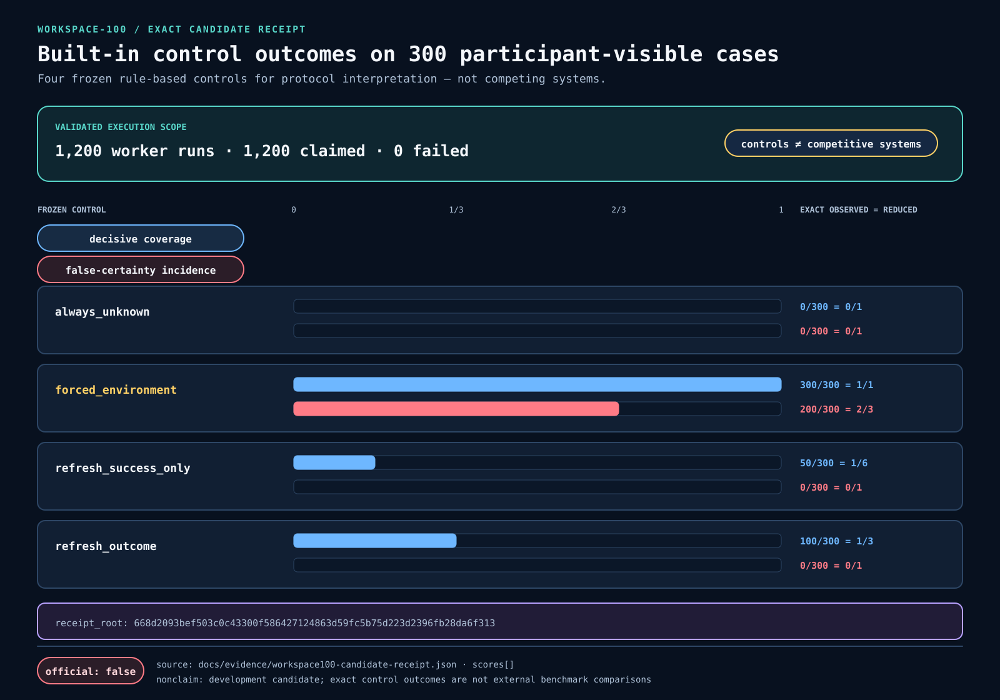

The committed evidence can be checked without regenerating the expensive
candidate:

```bash
python tools/workspace100_candidate_evidence.py check
```

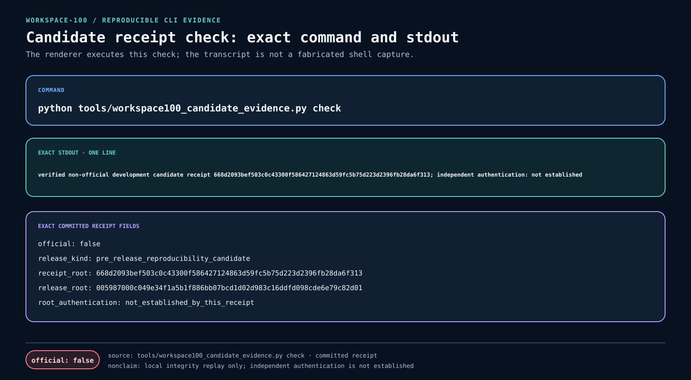

That command validates the closed receipt, pinned local roots, reviewed score
counts, and current source/content closure. Those pins detect drift in this
Git history; they do not authenticate an external publisher.

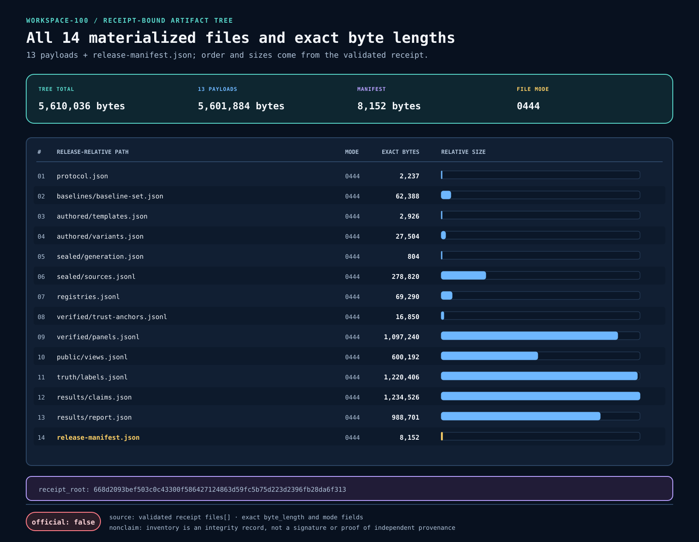

### What remains open

- **Gate 12 — reproducibility:** open. Only one clean runtime-bound capture
  exists, and the actual frozen programs have not run under a second valid
  transient schedule.
- **Gate 16 — hostile-code isolation:** open. The local backend is only for
  reviewed built-ins.
- **Public identity:** absent. No independently authenticated public root,
  signature, transparency record, or official Workspace-100 release exists.

## Release architecture

The release builder emits a closed allowlist of 13 canonical payload files and
one manifest below `workspace100/v1`. Materialization uses read-only `0444`
files and `0555` directories; loading rejects unexpected paths, mutable modes,
symlink traversal, root disagreement, and malformed canonical records before
semantic verification.

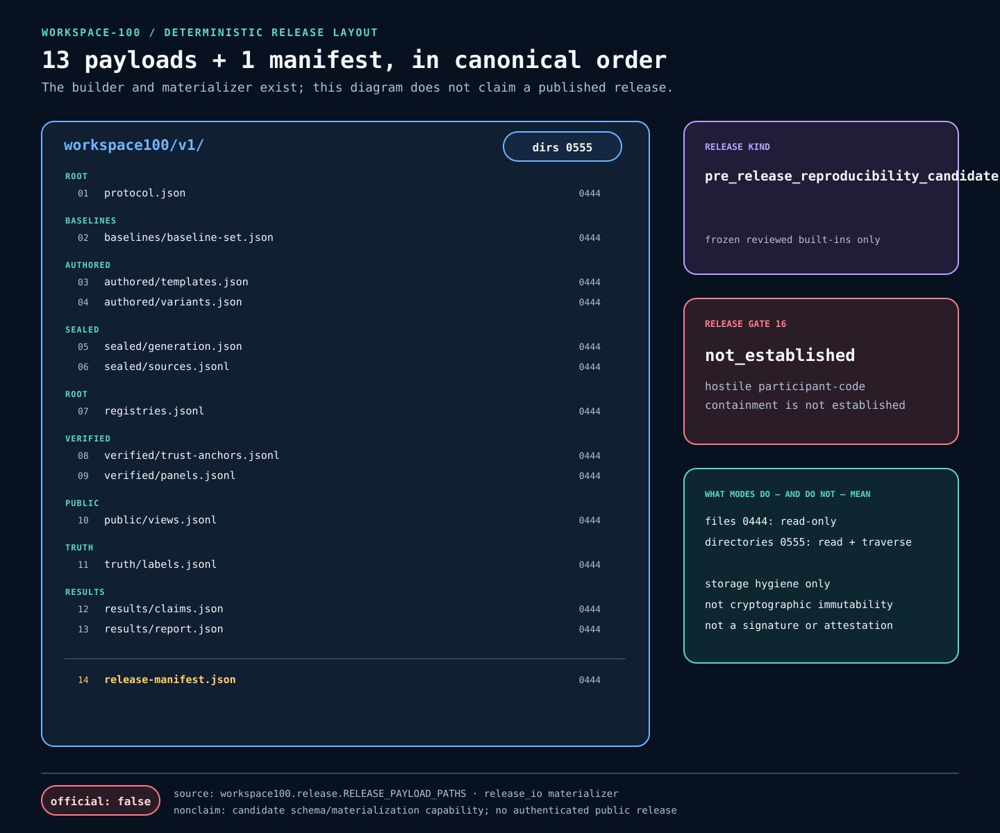

The manifest closes over 25 bindings: content roots, implementation identities,
execution configuration, and a trust-anchor set. The semantic verifier
reconstructs the corpus, views, and truth; validates the stored canonical
ClaimSet against the rebuilt protocol objects and pinned execution contract;
recomputes scores and the report; and compares reconstructed release bytes with
the expected release root. It does not rerun the 1,200 workers.

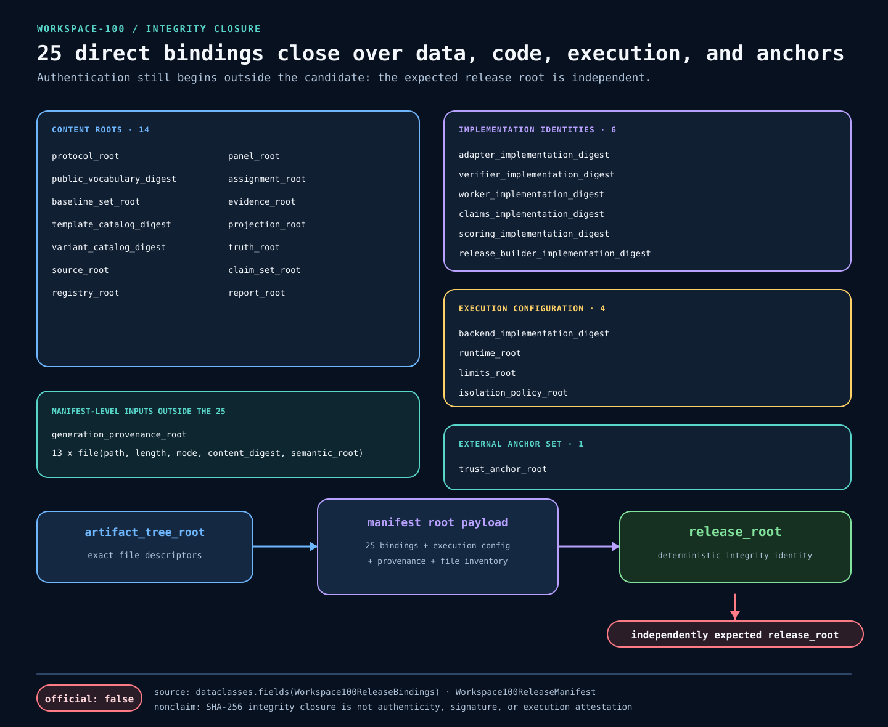

Three properties are deliberately kept separate:

- **Integrity and content identity:** canonical encodings and
  domain-separated digests make changed bytes or bindings produce different
  roots.
- **Authentication and attestation:** signatures, an independently trusted
  release channel, and runtime attestation are outside the current
  implementation.
- **Historical provenance:** replay can demonstrate current semantic
  agreement, but cannot prove who produced an earlier run or which runtime
  executed it.

A self-consistent tree can therefore be verified structurally without being
authenticated as an official public release. Consumers must pin the expected
root outside the candidate.

## Worker boundary

`LocalPythonProcessBackend` is a lifecycle harness for the four reviewed
stdlib-only programs. For each evidence record it:

- stages exact program bytes in a fresh private directory;
- launches a new POSIX process session with `-s -S -B -P`;
- supplies one canonical evidence record on standard input;
- builds a closed environment instead of inheriting credentials, proxy
  variables, or `PYTHONPATH`;
- bounds standard input, output, error, and wall time;
- parses exactly one canonical claim; and
- terminates the process group and reaps the direct child on every outcome.

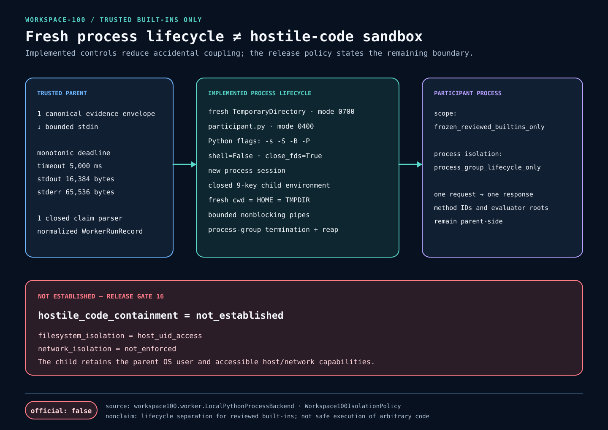

This boundary removes persistent process memory and an explicit case-order
channel. It is **not a sandbox**: the child retains the evaluator’s host UID,
filesystem, network, process namespace, and external shared-state
capabilities. Running arbitrary participant code requires a separate,
independently pinned OS-level backend with filesystem, identity, network,
metadata-service, resource, namespace, and cgroup controls.

## Hard engineering decisions

- **Verify exact bytes, not executable objects.** The verifier resolves a
  closed adapter from digest-bound source and reconstructs a fresh world for
  every replay and probe.
- **Keep search outside the trust path.** Cached minimal witnesses and target
  families help construction, but accepted certificates are independently
  replayed from sealed source openings.
- **Bind evidence at its real grain.** Trace-only and owner-probe twins
  deduplicate to pair-level cases; informative views remain
  completion-specific.
- **Separate public and private capabilities.** Participants receive one
  evidence envelope. Sources, routes, truth, labels, and score machinery stay
  evaluator-side.
- **Preserve failures rather than reinterpret them.** Timeouts, output bounds,
  nonzero exits, empty output, and invalid claims remain distinct rooted worker
  outcomes.
- **Use exact arithmetic.** Score tables store raw counts and rational values;
  zero denominators carry explicit `not_applicable` reasons.
- **Make release verification semantic.** Hash checks are followed by corpus,
  view, and truth reconstruction, stored-ClaimSet validation, score/report
  recomputation, and binding replay; hashes are not treated as proof of
  correctness by themselves.

## Reproduce the repository checks

After the hash-locked installation above, the local verification path mirrors
CI:

```bash
ruff check src test tools
mypy --strict src test tools
python tools/workspace100_candidate_evidence.py check
python tools/render_readme_visuals.py check
python tools/verify_distribution.py
witnessgap example
pytest
```

CI runs on Ubuntu 24.04 with CPython 3.12.3, read-only repository permissions,
SHA-pinned GitHub Actions, a hash-locked dependency install, and an editable
package install. CI also builds the declared source archive twice, rejects
unsafe or colliding archive paths, rebuilds a byte-identical pure-Python wheel
twice from that extracted sdist, replays wheel metadata and `RECORD`, installs
with no package index into a clean virtual environment, and probes both module
and console entry points outside the checkout. The `py3-none-any` tag records
the absence of a native ABI; this repository verifies execution only on exact
CPython 3.12.3 and Linux x86_64, and the no-index install is not a claim of
network sandboxing. The candidate evidence and README visual checks fail when
committed artifacts drift from their reviewed sources.

The SVGs in this README are generated from production constructors, enums,
release schemas, the committed candidate receipt, and the CI workflow:

```bash
python tools/render_readme_visuals.py write
python tools/render_readme_visuals.py check
```

Their source paths, SHA-256 digests, extracted facts, nonclaims, and output
digests are recorded in the
[visual provenance manifest](docs/images/readme/provenance.json). The diagrams
contain no external fonts, remote assets, secrets, personal data, or fabricated
benchmark observations.

## Repository map

| Area | Where to start |
| --- | --- |
| Finite-family reasoning | [`identifiability.py`](src/witnessgap/identifiability.py), [`oracle.py`](src/witnessgap/oracle.py) |
| Independent certificate verification | [`verifier.py`](src/witnessgap/verifier.py), [attribution contract](docs/attribution-contract.md) |
| Workspace-100 construction | [`workspace100/`](src/witnessgap/workspace100), [frozen protocol](docs/workspace-100-protocol.md) |
| Participant evidence and execution records | [worker boundary](docs/worker-boundary.md), [ClaimSet contract](docs/claim-set.md) |
| Built-in controls and scoring | [baseline bundles](docs/baseline-bundles.md), [scoring contract](docs/scoring-report.md) |
| Release capture and verification | [`candidate_capture.py`](src/witnessgap/workspace100/candidate_capture.py), [candidate receipt](docs/evidence/workspace100-candidate-receipt.json) |
| Security boundary | [threat model](docs/threat-model.md) |
| Reproducible evidence | [`tools/`](tools), [visual provenance](docs/images/readme/provenance.json) |
| Tests | [`test/`](test) |

## Related work

WitnessGap is complementary to, rather than an implementation of:

- [Causal Agent Replay](https://arxiv.org/abs/2606.08275)
- [CausalFlow](https://arxiv.org/abs/2605.25338)
- [REFLECT](https://arxiv.org/abs/2606.09071)
- [Who&When Pro](https://arxiv.org/abs/2607.09996)

## License

[Apache-2.0](LICENSE)
